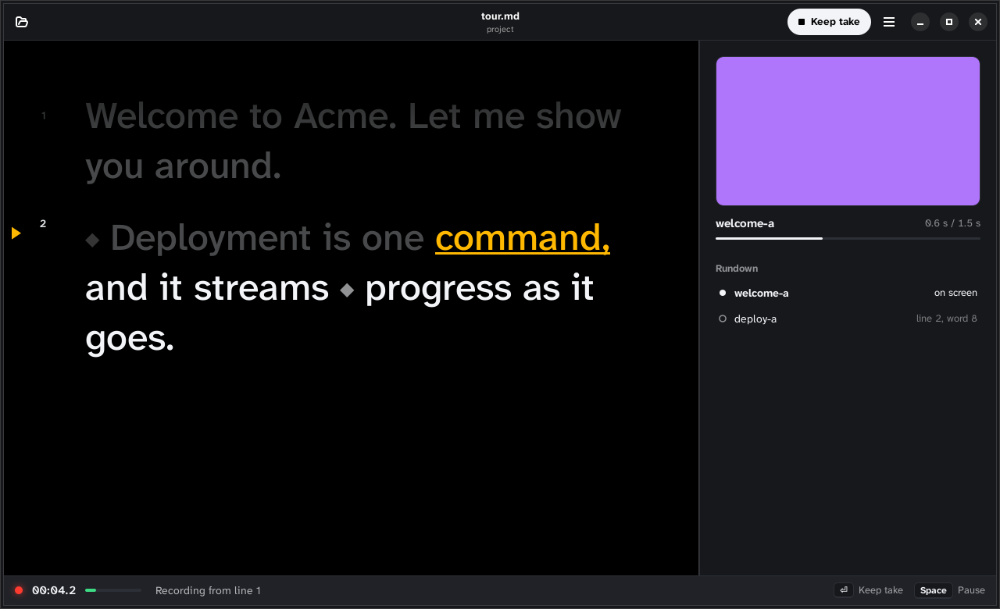

# Reading from a prompter



`teleprompt serve <script>` shows the script's narration as a prompter that
follows your voice. It listens through the microphone, works out where you
are by matching what a local speech model hears against the script, and
keeps the next word highlighted a third of the way down the screen. Nothing
you say leaves the machine.

It is one page, in a browser or in an app: `apps/linux` and `apps/macos`
launch `teleprompt serve` themselves and show the same page in a window of
their own, with a welcome page, settings and setup around it. Their READMEs
say how to build them. To follow your voice, all of them need the
recognizer and the model below.
To have the script's voice read it instead, none do (see [Letting a voice
read it](#letting-a-voice-read-it)).

## Setting it up

The recognizer is opt-in, because it downloads a native library (about
23 MB) when it builds:

```bash
cargo install --path crates/teleprompt-cli --features listen
```

It also needs a speech model (310 MB), which teleprompt downloads only when
you ask:

```bash
teleprompt setup prompt --run
```

The apps ask for you: open a script to read aloud without the model, and
they offer to install it, then open the script. **Set up teleprompt**, on
the welcome page and in Settings, lists everything else they can install,
each use with what it still needs and how much it downloads, as
`teleprompt setup` does in a terminal. A command that needs your password
(`apt`, say) goes through the desktop's password dialog where there is one
(`pkexec`), and otherwise says to run it in a terminal.

That is sherpa-onnx's streaming English model (Apache-2.0), unpacked into
`~/.local/share/teleprompt/models` (or `$TELEPROMPT_MODELS`), where
`serve`, `record` and `import` find it. Without `--run`, `setup` prints the
command instead. To keep a model elsewhere, download and unpack it yourself
and pass its directory with `--model`. The smaller 20M model is cheaper but
misses the first words of a take.

## Reading

```bash
teleprompt serve scripts/tour.md
```

Open the address it prints, press Ctrl+Shift+Space (⌘⇧Space on a Mac) to
start, and read. While you are on air, the glass has a red frame.
Everything you read is a take: press the key again to keep it, or Escape to
throw it away. Between takes, click any line to start a new take from
there, which is how you read one line again.

| key | does |
|---|---|
| Ctrl+Shift+Space (⌘⇧Space on a Mac) | start a take from the line you are on; during one, keep it |
| Ctrl+Enter (⌘Enter) | keep the take |
| Escape | throw the take away, or cancel the count before it |
| Ctrl+Z (⌘Z) | undo the take just kept: each line gets back the recording it replaced |
| click a line, or Enter on it | between takes, start a new take from that line |
| r | record again, one after another, the lines reworded since their takes |
| e | Edit: move and stretch the shots on the glass |
| ? | list these keys |
| p | pause and resume listening |
| w | review a line said in other words than it reads |
| m | mirror the text, for beam-splitter glass |
| + and − | text size |
| s | hide or show the screen |

On a tablet or phone, the buttons at the top left do the same: text size,
mirroring, and the list of keys. The text size and mirroring are
remembered for next time.

It follows you, not a clock: stop, and it waits; misread a word, add an
aside or skip a sentence, and it keeps its place. It jumps ahead only when
several words in a row match further on, so a single word that happens to
occur later does not make the text lurch.

## The screen follows you

When the script has action blocks, the prompter shows their captured clips
beside the text, and starts each one when your voice gets to it. A marker in
the text shows where each shot starts:

| the block's policy | the shot starts |
|---|---|
| `hold` | when you finish the line above it |
| `concurrent` | on the line's first word, or on its `cue=` phrase |
| no line of its own | when you finish the line before it |

A shot the video would start part-way through its line (`align=end` or
`center`) starts on the word the plan puts it at.

Capture the clips first, with `teleprompt capture`. A shot without a clip
shows as missing, both in the text and on the screen. If you read on before
a clip ends, the next shot cuts it off, because the screen follows you and
not the clock. Press `s` to hide or show the screen, and **Own window**,
above the rundown, puts it in a window of its own, for a second display.

Clips are H.264, which Chrome, Edge, Safari and the macOS app play, and the
Linux app with GStreamer's libav plugin. Chromium builds without
proprietary codecs cannot play them.

**Capture** and **Build**, at the top, run `teleprompt capture` and
`teleprompt build` on the script, as you would in a terminal, and say how
far they have got as they go. A build leaves the video where `build` puts
it, and says where.

## Moving shots on the glass

**Edit** (or `e`) shows each shot under the words it plays over, in its
scene's colour, or after its line when it plays once the line is said.

- Drag a shot onto a word to start it there, on its own line or another.
  Drop it past a line's last word to play it after the line.
- Drag a shot's grip, at its end, along its line to make it last until that
  word.
- Hover over a word to see on the screen what plays as it is said.

While you drag, a label says what the drop will do. Each drop goes through
`teleprompt edit` (`cue`, `hold`, `move` and `stretch` on the command
line), which writes nothing that would not compile, and Ctrl+Z (⌘Z) puts
the script back as it was before it.

## Letting a voice read it

You don't have to narrate. `teleprompt serve --voice` reads the script
with its voice (the `[voice]` in `teleprompt.toml`) instead of following
yours, and needs no recognizer or speech model, in any build:

```bash
teleprompt serve --voice scripts/tour.md
```

Open the address it prints. In the apps, choose **A voice reads** under
"Who narrates" on the welcome page. The voice makes each line in the
background, into the same cache `dub` and `build` use, and the margin marks
each line: a waveform, faint until the line is made; a tick for a line you
recorded yourself, which plays from your take.

- **Space** (or **Play**) plays the video from the line you're on, as it
  will play: each line at its length in the video, lighting each word as
  it's said, and each shot where the plan puts it. Space again, or Escape,
  stops; ← and → skip five seconds.
- **V** (or **Play video**) does the same from the top, and works when you
  read the script yourself too, between takes, when the project has a voice.
- When you save, the lines whose timing changed are marked in the margin,
  and **J** plays them again; while playing, it carries on from the first.
  A save that doesn't compile shows its errors above the glass, which keeps
  the last version that did.
- **Click a line** for its panel. **Listen** plays that line alone, and
  **Read on from here** plays from it. **How to say it** tells the voice
  how to read it ("slower, amused"), for a backend that takes directions;
  it's written to the script as the line's `voice.instruct`. **Say it
  again** has the voice make it anew, for a voice that says a line
  differently each time.
- **F2**, or **Reword…** in the panel, edits the line's words where they
  stand: Enter keeps them, Escape leaves the line as it was. F2 works when
  you read the script yourself too, between takes.

Every change goes through `teleprompt edit` (`reword <line> <text>` and
`instruct <line> [text]` on the command line), which writes nothing that
would not compile; Ctrl+Z (⌘Z) undoes the last, unless you have changed
the file since. For anything bigger, such as lines added, split or moved,
or a shot's block changed, edit the script in your own editor (the apps'
**Open in Editor**, Ctrl+E or ⌘E, opens it there): the prompter picks up
what you save within a few seconds. Where the voice gives no word timings, a word's moment is
estimated from its share of the line's letters, so the highlight may run a
word early or late.

## Recording

When you keep a take, each line you read in full is saved as that line's
recording, `takes/<line>.wav`. The recording it replaces is put aside, in
`takes/.previous/`, and **Undo** on the message that says what was kept (or
Ctrl+Z) puts it back. A line you broke off or skipped is not saved. The take is cut between lines at the pause
after each one, so leave a breath between paragraphs. Lines with a
recording are marked at their left edge.

A recorded line is the line's voice from then on: `plan`, `dub`, `build`
and the prompter's video use it, paced to its real length, and the lines without one
are synthesized. Every command names those. Edit a line and its recording
no longer matches it, so the line is synthesized until you read it again.
Press `r` to read those lines again one after another: each take starts on
the next reworded line and is kept once you have read past it.

Recordings are source, like the script: commit `takes/`. The microphone is
recorded as it is, without the browser's noise suppression, so record
somewhere quiet.

## Keeping what you said

A line you read in full in other words than it reads, a word swapped or
left out, is still kept, and gets a blue dot beside its mark, with a
toast. Press W to see the difference: the words you didn't say struck
through, the ones you said instead in bold. **Use What I Said** rewords
the line in the script to match, as `teleprompt edit <script> said
<line>` does, and its recording stays current: nothing to read again.
**Keep the Script**, or Escape, leaves the line as written, to read
again; you aren't asked about it again until you reload the page. A small
speech model mishears, so a word a letter off, or heard as two ("a
round"), doesn't count as other words.
