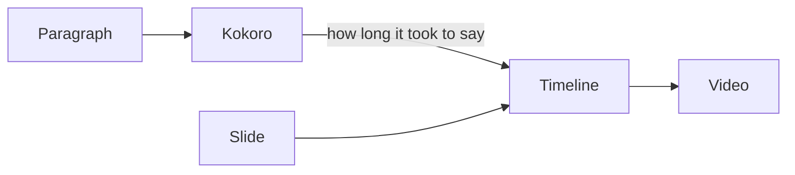

# Narrated slides

A Slidev deck, spoken by teleprompt

<!--
This video is a Slidev deck, narrated. Every sentence is a speaker note in
the deck, spoken by Kokoro, and every picture is a slide from that same
ordinary deck.
-->

---

# Your deck stays a deck

<v-clicks>

- `slidev` still presents it
- `slidev export` still exports it
- teleprompt only names the slides

</v-clicks>

<!--
The deck does not change to be narrated.
[click] You can still present it with Slidev.
[click] You can still export it.
[click] teleprompt only names the slides, and reveals each point as it is spoken.
-->

---

# A block names a slide

~~~text
The second point is the one that matters.

```teleprompt scene=slides
2?clicks=2
```
~~~

The slide number, and how many clicks into it — the way Slidev's own URLs say it.

<!--
A block names one slide, and how many clicks into it, the way Slidev's own
URLs do. You do not write these blocks yourself: teleprompt drafts them
from the notes.
-->

---

# Where the time comes from



<!--
Each slide stays on screen for exactly as long as its sentence takes to
say. The narration decides the timing, and the slides follow.
-->

---
layout: center
---

# Edit a sentence. Rebuild.

Only what changed is spoken, or exported, again.

<!--
The draft is yours to edit from here. Change a sentence and rebuild, and
only what changed is spoken, or exported, again.
-->
