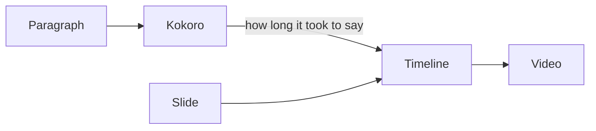

# Narrated slides

A Slidev deck, spoken by teleprompt

---

# Your deck stays a deck

<v-clicks>

- `slidev` still presents it
- `slidev export` still exports it
- teleprompt only names the slides

</v-clicks>

---

# A block names a slide

~~~text
The second point is the one that matters.

```teleprompt scene=slides
2?clicks=2
```
~~~

The slide number, and how many clicks into it — the way Slidev's own URLs say it.

---

# Where the time comes from



---
layout: center
---

# Edit a sentence. Rebuild.

Only what changed is spoken, or exported, again.
